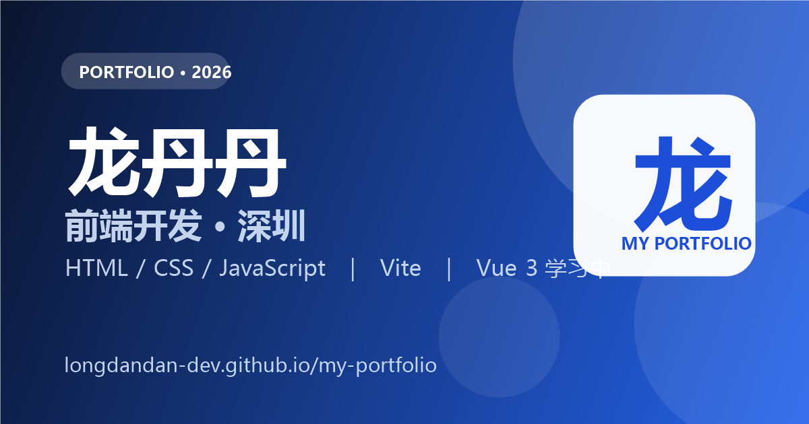

# 龙丹丹 · 前端开发作品集

一个用 HTML、CSS、JavaScript 手写的个人作品集官网，展示我目前完成的 4 个项目。

在线地址：<https://longdandan-dev.github.io/my-portfolio/>



## 项目亮点

- 移动优先响应式布局，覆盖手机、平板、桌面三档宽度
- 作品卡片由 JavaScript 数据驱动渲染，新增作品只需要修改数据
- 支持键盘完整访问，包含焦点环和跳到主要内容链接
- 补齐 SEO 与社交分享信息，分享链接时能显示完整卡片
- 通过 GitHub Pages 发布，走通从开发、打包到上线的完整流程

## 技术栈

- HTML5 语义化标签
- CSS：CSS 变量、Flex、Grid、媒体查询、`:focus-visible`
- JavaScript：对象数组、模板字符串、`map`、DOM 操作
- Vite：开发服务器、生产构建、子路径部署
- Git / GitHub Pages：版本管理与线上发布

## 关键实现

### 1. 数据驱动渲染

作品数据统一放在 `src/main.js` 的 `works` 数组里，页面加载时通过 `map()` 生成卡片 HTML，再一次性渲染到作品区。

想新增一部作品，只需要往数组里加一个对象，HTML 不需要手动复制。

### 2. 响应式三档

项目采用移动优先写法：

- 默认样式面向手机
- `768px` 起适配平板
- `1280px` 起适配桌面

卡片墙使用 `repeat(auto-fit, minmax(...))`，可以在不同宽度下自动调整列数。

### 3. 无障碍与细节

- 导航、按钮都有明显的键盘焦点环
- 页面顶部提供“跳到主要内容”链接
- 导航和按钮补齐 `hover`、`focus-visible`、`active` 三种状态
- 主要文字与背景的对比度经过检查

### 4. 上线配置

项目部署在 GitHub Pages 的子路径下，因此 `vite.config.js` 中配置了：

```js
base: '/my-portfolio/'
```

构建产物输出到 `docs` 目录，GitHub Pages 从 `main` 分支的 `/docs` 文件夹发布。

## 本地运行

```powershell
npm install
npm run dev
```

打开终端显示的地址，默认是：

```text
http://localhost:5173/
```

## 构建与预览

```powershell
npm run build
npm run preview
```

- `npm run build`：生成线上版本到 `docs/`
- `npm run preview`：本地预览打包后的结果

## 目录结构

```text
my-portfolio/
├─ public/           # 原样拷贝的静态资源
├─ src/
│  ├─ main.js        # 作品数据与渲染逻辑
│  └─ style.css      # 全站样式
├─ docs/             # 打包后的线上版本
├─ index.html        # 页面入口
└─ vite.config.js    # Vite 构建与部署配置
```

## 后续计划

- 用 Vue 3 + TypeScript 重写已有项目
- 补充更多能现场演示和讲清实现思路的项目
- 持续完善作品说明、演示链接和项目截图

## 联系

GitHub：<https://github.com/longdandan-dev>
