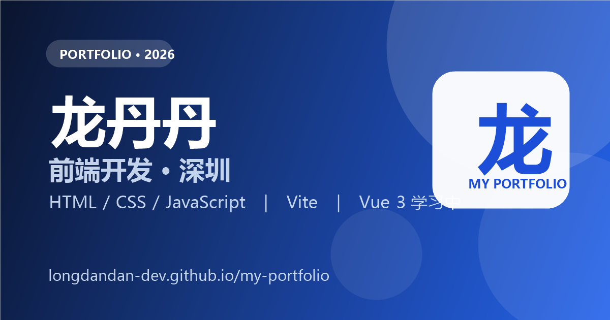

# 龙丹丹 · 前端开发作品集

一个用 HTML、CSS、JavaScript 手写的个人作品集官网，展示我目前完成的 6 个项目。

在线地址：<https://longdandan-dev.github.io/my-portfolio/>



## 项目亮点

- 移动优先响应式布局，覆盖手机、平板、桌面三档宽度
- 作品卡片由 JavaScript 数据驱动渲染，新增作品只需要修改数据
- 支持键盘完整访问，包含焦点环和跳到主要内容链接
- 一整套设计令牌（颜色 / 字号 / 间距 / 动效）加一条反复出现的视觉母题
- 把正常、悬停、键盘聚焦、按下、当前、空这几种状态都做出来了
- 补齐 SEO 与社交分享信息，分享链接时能显示完整卡片
- 通过 GitHub Pages 发布，走通从开发、打包到上线的完整流程

## 技术栈

- HTML5 语义化标签
- CSS：CSS 变量、Flex、Grid、媒体查询、`:focus-visible`
- JavaScript：对象数组、模板字符串、`map`、DOM 操作
- Vite：开发服务器、生产构建、子路径部署
- Git / GitHub Pages：版本管理与线上发布

## 关键实现

### 1. 数据驱动渲染

作品数据统一放在 `src/main.js` 的 `works` 数组里，页面加载时通过 `map()` 生成卡片 HTML，再一次性渲染到作品区。

想新增一部作品，只需要往数组里加一个对象，HTML 不需要手动复制。

**加一个新项目时按这 4 步走：**

1. `src/main.js` 的 `works` 数组加一条 —— 卡片、右上角序号、首屏的"几个项目"、关于我里的名单都会自己跟上（这几处由 JS 从数据算出来，不用回来改）
2. 改 `index.html` 里的 `<meta name="description">` 和 `og:description` 的数量与名单 —— 这两处是给搜索引擎和分享卡片看的，抓取方不跑 JavaScript，只能手写
3. `npm run build`
4. `git add -A` → `commit` → `push`，等 GitHub Pages 自动换版

### 2. 响应式三档

项目采用移动优先写法：

- 默认样式面向手机
- `768px` 起适配平板
- `1280px` 起适配桌面

卡片墙使用 `repeat(auto-fit, minmax(...))`，可以在不同宽度下自动调整列数。

### 3. 无障碍与细节

- 导航、按钮都有明显的键盘焦点环
- 页面顶部提供“跳到主要内容”链接
- 导航和按钮补齐 `hover`、`focus-visible`、`active` 三种状态
- 主要文字与背景的对比度经过检查

### 4. 上线配置

项目部署在 GitHub Pages 的子路径下，因此 `vite.config.js` 中配置了：

```js
base: '/my-portfolio/'
```

构建产物输出到 `docs` 目录，GitHub Pages 从 `main` 分支的 `/docs` 文件夹发布。

### 5. 设计系统（设计打磨那一轮的成果）

颜色、字号、间距、圆角、阴影、动效全部收进 `src/style.css` 顶部的 `:root` 里，样式表里不再出现"散装"的颜色值和魔法数字。

- **颜色**：主色三档 —— 常态 `--color-primary`、浅底上的文字与悬停 `--color-primary-dark`、按住 `--color-primary-deep`；文字三档 —— 标题 / 正文 / 次要；另有页面底、浅灰底、两种边框
- **字号只留 6 档**：13 / 15 / 16 / 20 / 32，加一个 `clamp(34px, 4.6vw, 56px)` 管首屏大标题（一套值顶掉三档媒体查询）
- **间距只用 4 和 8 的倍数**：`--sp-1` 到 `--sp-24`
- **动效全班统一**：一个时长 `--dur: .2s`、一条缓动 `--ease`

**视觉母题：一条 3px 主色渐变**（`--grad-brand`），在三个地方反复出现：

1. 首屏面板的顶边
2. 每个区块标题的上方（40px 宽）
3. 卡片顶边 —— 平时宽度 0，悬停时从左展开到满

**状态表**（"八态"里，加载中和出错这两态对本页不适用，因为整个页面没有异步请求）：

| 状态 | 落在哪 | 做法 |
| --- | --- | --- |
| 正常 | 卡片 / 按钮 / 导航 | 白底 + 1px 边框 + 两层轻阴影 |
| 悬停 | 卡片 / 按钮 / 导航项 | 卡片抬起 4px、边框变主色、渐变条展开；按钮抬起 2px |
| 键盘聚焦 | 全部可点元素 | 一条统一的 2px 主色焦点环（实测 9 个元素 9 个都有环） |
| 按下 | 按钮 | 缩到 98%、底色换成最深主色、阴影摘掉 |
| 当前 | 导航项 | 滚到哪个区块，哪一项点亮，同时写上 `aria-current="true"` |
| 空 | 作品列表 | `works` 为空时显示一句说人话的空状态，不留一块白 |
| 减少动效 | 全站 | 过渡降到 0.01ms，`scroll-behavior` 退回 auto |
| 触摸屏 | 卡片 | 不装作有悬停（触摸屏点不出 hover） |

**对比度**：按 WCAG 公式从令牌算出来，21 组全部达标，正文类最低 4.86 : 1（"主色链接在浅灰底上"这一组）。浅色底上的文字一律用深一档的主色，就是为了过这 4.5 : 1。

**页头与页脚**：页头在页面下滚后浮起一层阴影，导航项跟着滚动位置高亮；页脚从一行版权扩成品牌 + 链接 + 更新日期，可点区域统一不低于 40px。

## 本地运行

```powershell
npm install
npm run dev
```

打开终端显示的地址，默认是：

```text
http://localhost:5173/
```

## 构建与预览

```powershell
npm run build
npm run preview
```

- `npm run build`：生成线上版本到 `docs/`
- `npm run preview`：本地预览打包后的结果

## 目录结构

```text
my-portfolio/
├─ public/           # 原样拷贝的静态资源
├─ src/
│  ├─ main.js        # 作品数据与渲染逻辑
│  └─ style.css      # 全站样式
├─ docs/             # 打包后的线上版本
├─ index.html        # 页面入口
└─ vite.config.js    # Vite 构建与部署配置
```

## 后续计划

- 用 Vue 3 + TypeScript 重写已有项目
- 补充更多能现场演示和讲清实现思路的项目
- 持续完善作品说明、演示链接和项目截图

## 联系

GitHub：<https://github.com/longdandan-dev>
